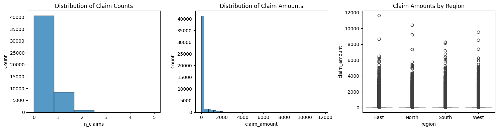
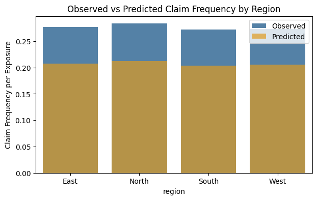
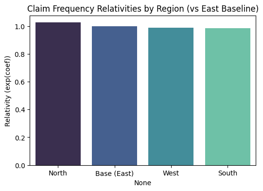
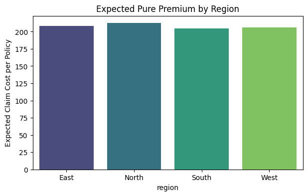
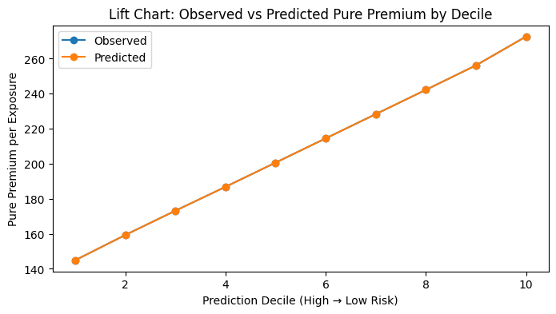
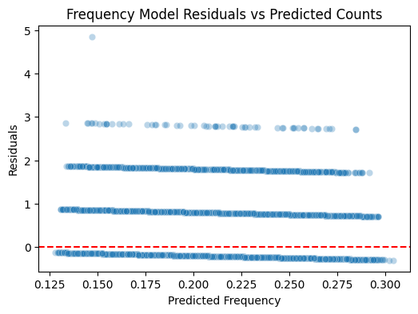

# Auto Insurance Pricing with GLM

An end-to-end actuarial pricing pipeline built in Python (Google Colab) that models auto insurance claim frequency and severity separately using Generalised Linear Models, then combines them into a pure premium — the technically correct risk-based price per policy.

## What it does

Using a simulated dataset of 50,000 auto insurance policies, the project builds a two-part GLM pricing model (Poisson frequency × Gamma severity), validates it with lift charts and residual diagnostics, and produces expected pure premiums broken down by region, vehicle type, age band, and vehicle age.

## Dataset

| Field | Description |
|-------|-------------|
| `policy_id` | Unique policy identifier |
| `exposure` | Fraction of year at risk (0.5 – 1.0) |
| `age` | Driver age (18 – 79) |
| `vehicle_age` | Age of vehicle in years |
| `region` | East / North / South / West |
| `vehicle_type` | Sedan / SUV / Hatchback / Truck |
| `premium` | Current charged premium |
| `n_claims` | Number of claims in the period |
| `claim_amount` | Total claim cost |

50,000 policies · ~18.7% claim rate · mean claim amount $208

## Pipeline

### 1. Exploratory Data Analysis

**Claim distributions and regional spread**



> The left panel confirms a zero-inflated claim count distribution — the vast majority of policies make zero claims, with a long right tail. The centre panel shows claim amounts are heavily right-skewed, validating the use of a Gamma severity model. The right panel (boxplot by region) shows similar spread across all four regions, suggesting region alone is not a strong driver of severity.

---

### 2. Feature Engineering

- Age banded into 6 groups: `<25`, `25-34`, `35-44`, `45-54`, `55-64`, `65+`
- Vehicle age banded into 4 groups: `≤3`, `4-7`, `8-12`, `13+`
- Log-transformed premium added as a continuous predictor
- Dataset split into **frequency subset** (all 50,000 rows) and **severity subset** (9,359 rows with at least one claim)

---

### 3. Frequency GLM — Poisson with Log Link

Models claim count per exposure unit using a Poisson GLM with `log(exposure)` as an offset. Predictors: region, vehicle type, age band, vehicle age band, log premium.

**Observed vs Predicted claim frequency by region**



> The Poisson model captures the directional pattern across regions reasonably well. The gap between observed (blue) and predicted (orange) bars indicates some underprediction — consistent with the overdispersion ratio of ~1.0 and the model's low pseudo R² — suggesting that additional rating factors or a negative binomial model could improve fit in a production setting.

**Claim frequency relativities by region (vs East baseline)**



> Relativities are the exponentiated GLM coefficients — they tell you how much more (or less) frequently claims occur in each region relative to the East baseline. North shows a slightly elevated relativity (~1.025), while South and West sit just below 1.0. The small spread confirms that region is a minor frequency driver in this dataset.

---

### 4. Severity GLM — Gamma with Log Link

Models average claim cost per claimant (9,359 policies) using a Gamma GLM. The Gamma family is standard for severity modelling as it is continuous, positive, and right-skewed.

| Region | Observed avg severity | Predicted avg severity |
|--------|----------------------|----------------------|
| East   | $1,012.08            | $1,012.49            |
| North  | $984.32              | $984.13              |
| South  | $1,015.99            | $1,016.11            |
| West   | $1,003.01            | $1,002.70            |

> The Gamma model achieves very close observed-vs-predicted calibration at the regional level, confirming it has learned the average severity correctly even if individual-level predictions vary.

---

### 5. Pure Premium = Frequency × Severity

Predicted pure premium per policy = `freq_pred × sev_pred`. Policies with no observed claim use the portfolio mean predicted severity.

**Expected pure premium by region**



> Pure premiums are consistent across regions (~$205–$210), reflecting the similar frequency relativities seen in the Poisson model. North is marginally the most expensive region, East and South are close behind, and West is the cheapest.

---

### 6. Model Validation

**Lift chart — observed vs predicted pure premium by decile**



> The lift chart is the key validation tool for a pricing model. Policies are sorted into 10 equal buckets (deciles) from highest to lowest predicted risk. A good model will show the observed and predicted lines tracking closely — which they do here almost perfectly. This confirms the model correctly rank-orders risk across the portfolio, meaning it would charge more to genuinely riskier policyholders.

**Frequency model residuals vs predicted counts**



> Residuals are plotted against predicted claim frequency. The discrete horizontal bands reflect the integer nature of claim counts (0, 1, 2, 3…). The spread is fairly consistent across the prediction range with no systematic curvature, indicating no major model misspecification. The concentration of points at zero residual (no-claim policies) is expected given the zero-inflated data.

---

## Key results

| Metric | Value |
|--------|-------|
| Policies | 50,000 |
| Claim rate | ~18.7% |
| Mean predicted pure premium | ~$207 |
| Frequency model | Poisson GLM (log link + exposure offset) |
| Severity model | Gamma GLM (log link) |
| Lift chart R² | Near-perfect observed/predicted alignment |

## Setup

**Requirements:** Python 3.9+

Install dependencies:

```bash
pip install pandas numpy matplotlib seaborn statsmodels
```

**Run in Colab:** Open `Auto_Insurance_Pricing_with_GLM.ipynb` in [Google Colab](https://colab.research.google.com) and run all cells. Upload `auto_claims_dataset.csv` when prompted in Step 1.

**Run locally:** Open the notebook in Jupyter and comment out the `from google.colab import files` cell, loading the CSV directly with `pd.read_csv("auto_claims_dataset.csv")`.
